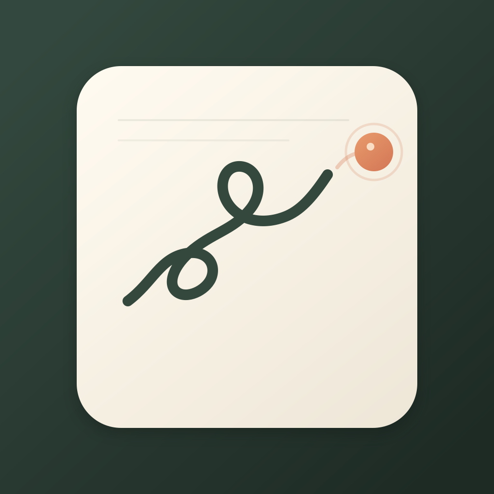
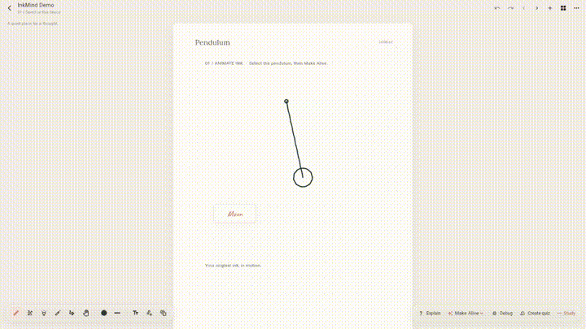
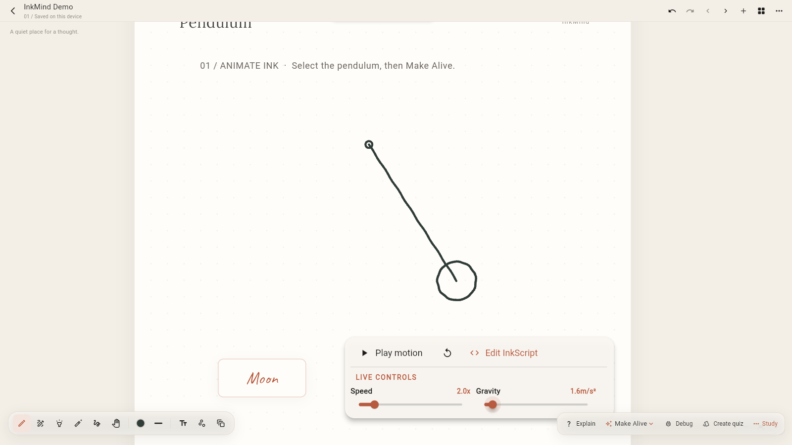
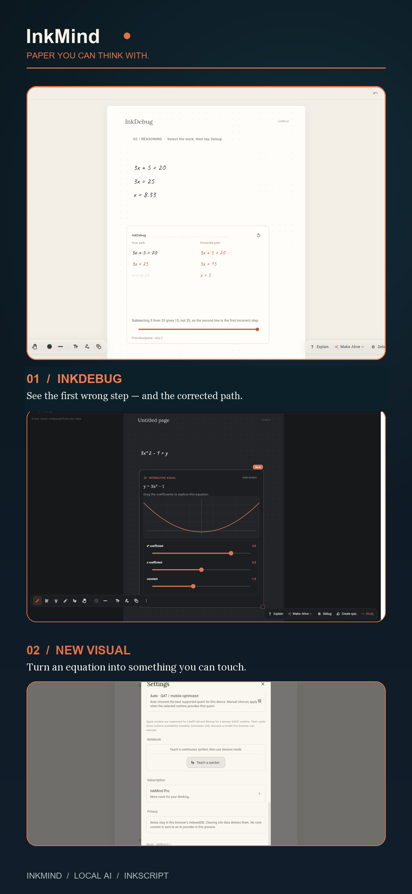

<p align="center">
  
</p>

# InkMind

**Paper you can think with.**

InkMind is a local-first handwritten notebook where your ink can move, become interactive, and help you debug your reasoning with on-device AI.

Instead of moving your thinking into a chatbot, InkMind brings intelligence directly onto the page.

**See the interaction immediately:**

<p align="center">
  
</p>

<p align="center">
  
</p>

The original strokes stay on the page. A handwritten **Moon** modifier changes the pendulum's gravity, and the simulation runs on the ink itself.

## What it does

- **Animate Ink** — animate the original vector strokes: pendulums, birds, plants, and diagrams.
- **InkMatter** — connect handwritten modifiers such as `Moon → pendulum` and apply deterministic physics.
- **InkDebug** — rewind stroke history, stop at the first wrong transformation, and branch into a corrected path.
- **New Visual** — turn an equation or diagram into a polished interactive visual using InkScript.
- **Local AI** — route tasks to compatible browser or native models, with visible model and quantization selection.
- **InkMind Pro** — unlock advanced AI, animation, InkCells, and subscription features through RevenueCat.

### Explain and Create quiz

The **Explain** button reads the current selection (or the ready-to-use idea on the demo page) and adds a plain-language explanation beside it. It uses the selected ink as the source, keeps the response grounded in that content, and shows an error instead of silently inventing an answer if the AI cannot respond.

The **Create quiz** button uses the same selected content to generate a three-question interactive quiz. Each question includes choices, the correct answer, and an explanation. The quiz is inserted as an InkCell on the page so it can be answered directly and revisited later. Both actions work with the browser AI worker or the optional local companion; the first AI use may download model weights.

## InkScript

InkScript is a small, constrained language for visuals and motion. The AI produces a draw-first script; InkMind validates it, compiles it to InkIR, and renders it through deterministic Flutter widgets. This keeps generated output direct, inspectable, and safe to run.

```text
draw pendulum from stroke:0
bind pendulum.gravity = 1.62
animate pendulum.swing(period: 2.4s)
```

## Local AI

The browser can use the bundled worker and the optional local companion in `tools/native_ai_runner.mjs`. Automatic model selection chooses a compatible model and quantization for the device. The first use downloads model weights; later runs use the local cache.

Available catalog entries include Qwen 2.5 Coder, Gemma 4 E2B/E4B, Spark-X2.5, and Ternary Bonsai 2 27B. Runtime availability depends on the target device and backend.

## Run it

Requirements: Flutter 3.8+, Dart, and a configured Flutter target. Microsoft Edge is required for the web preview.

```bash
git clone https://github.com/sameh610/InkMind.git
cd InkMind
flutter pub get
flutter run -d edge
```

For the optional local browser-AI companion, install Node dependencies and run it separately:

```bash
npm install
node tools/native_ai_runner.mjs
```

For Android, connect a device or start an emulator and run `flutter run -d <device-id>`. iOS builds require macOS, Xcode, and CocoaPods.

RevenueCat uses demo billing by default. To enable the RevenueCat Test Store during development:

```bash
flutter run -d <device-id> \
  --dart-define=REVENUECAT_ENABLED=true \
  --dart-define=REVENUECAT_PUBLIC_KEY=test_JzFpbMzQLHIhMFJSQSAlsATUSRw
```

## Devpost submission assets

The project icon is preserved at the required **1024×1024** size:

`inkmind-app-icon-1024.png`

The portrait screenshot below is a separate, device-frame-free **1179×2556** asset suitable for the Devpost screenshot requirement:

`assets/devpost-inkmind-portrait.png`

<p align="center">
  
</p>

## Tests

```bash
flutter analyze
flutter test
node --test tools/*.test.js tools/*.test.mjs
```

## Project structure

```text
lib/                    Flutter app, canvas, AI, InkScript, simulations
assets/                 Fonts, branding, and Devpost artwork
web/                    Flutter web shell and browser AI bridge
tools/                  Native runner, model router, compiler, and probes
test/                   Flutter tests
demo/video/             Trailer source and Remotion project
android/                Android platform project
ios/                    iOS platform project
```

## License

Licensed under the [Apache License 2.0](LICENSE).

Third-party models and dependencies may have separate licenses.
